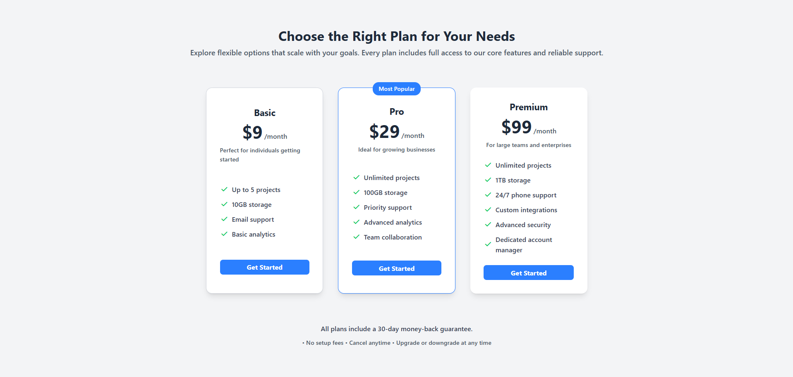

# 💸 Tailwind CSS 3-Tier Pricing Table

A modern, responsive, and accessible **3-tier pricing table** built with **Tailwind CSS** and **Material Symbols**.  
Designed by **Stephen William G. De Jesus**, this UI component allows users to compare flexible pricing plans — **Basic**, **Pro**, and **Premium** — ideal for SaaS platforms, business websites, or product landing pages.

---

## 📸 Preview  

### 🎞️ Live Interaction (GIF)  


### 🖼️ Static Screenshot (PNG)  


---

## 🌐 Live Demo  
[View Live Demo](https://bogiiiie.github.io/07-tailwind-3tier-pricing-table/)

---

## 📁 Features

✅ Responsive 3-column layout with adaptive mobile stacking  
✅ Highlighted **"Most Popular"** badge on Pro plan  
✅ Accessible HTML structure with ARIA labels  
✅ Material Symbols check icons for visual clarity  
✅ Hover animation for each card using Tailwind transitions  
✅ Organized pricing, description, and feature lists  
✅ Clearly labeled call-to-action buttons for each plan  
✅ 30-day money-back guarantee and flexible cancellation info  

---

## 🛠️ Built With

- **HTML5** – semantic structure and ARIA roles  
- **Tailwind CSS** – utility-first styling framework  
- **Google Material Symbols** – for feature check icons  

---

## 🚀 Getting Started

To run this project locally:

1. Clone the repository:
   ```bash
   git clone https://github.com/bogiiiie/07-tailwind-3tier-pricing-table.git
